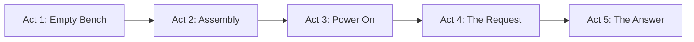
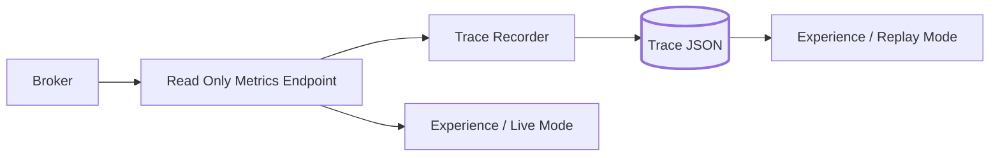

# Experience Design: OCS LLM Infrastructure VR

**Owner:** me
**Team:** Yash Parikh, Anvay Vahia
**Target:** Meta Quest 2 minimum, Quest 3 preferred
**Engine:** Unity 6 LTS, URP, standalone Android build

---

## 1. What this is

Five minutes in a headset that answers one question: what actually happens when you send a prompt to our system?

Most people's mental model of an LLM stops at a text box. This shows the rest of it. You stand next to a bare chassis, the rig assembles itself around you, it powers on, and then a request arrives and you watch it travel through the broker and the scheduler, out to a card in front of you, and back.

It is an experience, not a tutorial. Nobody is being tested and nothing is gated. The viewer watches, looks around, and leaves understanding something they did not understand before.

## 2. What success looks like

An experience can always be made slightly better, which is how projects like this never ship. So the bar is defined up front and it is not "it looks good."

- Runs start to finish in under five minutes with no operator intervention
- Holds 72 fps on a Quest 2 throughout
- Runs with no infrastructure available
- **Three people who are not on the team can explain afterward what the rigs do and where the model actually runs**

That last one is the real goal. The rest are constraints that keep it achievable.

## 3. The arc

**Act 1: Empty bench.** You are standing at a workbench. A bare chassis, a tray of parts, nothing running. Quiet. This establishes scale, which is the thing photos fail at. Eight graphics cards is a lot of hardware and people do not realize that until they are standing next to it.

**Act 2: Assembly.** The rig builds itself around you. Motherboard drops in, cards slot one at a time, risers thread, power connects. Driven by the same step data that came out of my Rig 2 build log, so the order is the real order. This is where a tiny amount of narration earns its place: one line per part, what it is and why it is there.

**Act 3: Power on.** Fans spin, cards light. The moment a pile of parts becomes a machine.

**Act 4: The request.** A prompt arrives. The system view opens up around the rig: client, broker, scheduler, rigs. The request travels the path with real per hop latency from a trace. Each hop labels itself as the request passes through.

**Act 5: The answer.** The path lands on the rig in front of you. One specific card lights up. You see its load and temperature climb while it works. Tokens come back out along the same path. Then the system view fades and you are standing next to the rig again, which is now just a machine on a bench.

The arc closing where it opened is the whole point. Same hardware, different understanding.

## 4. Data, and why replay comes first

The experience reads a trace: a recorded sequence of hops with real timings and real per card telemetry. It does not need a live system to play one.

Replay mode is built first and it is the mode that ships. Reasons:

- A demo that depends on the rigs being up is a demo that eventually does not happen
- I can build the entire experience before Anvay's broker is finished, so neither of us blocks the other
- A recorded trace can be picked for pacing. A live request might take 400 ms or 40 seconds, and 40 seconds of watching a progress bar is not an experience
- `Assets/Data/sample-trace.json` is hand written and already in the repo, so work can start today

Live mode is a later addition and a nice one for a demo with the rigs running. It is not the deliverable.

The trace format is in `docs/metrics-contract.md`. Send it to Anvay early so the broker logs those fields from the start. Retrofitting per hop tracing later is painful.

## 5. Performance

The Quest 2 is the constraint that shapes every art decision, the same way the GTX 1070 shapes the model decisions on the rig. Symmetry worth mentioning in the write up.

- Baked lighting. No realtime shadows on the rig mesh.
- Low poly parts with LODs. Eight near identical cards means GPU instancing.
- Text as world space UI, not geometry.
- No post processing stack until it has been profiled on device.
- Profile on the headset from V1. The editor tells you nothing useful about Quest performance.

Real triangle and draw call budgets come from profiling, not from a number picked now.

## 6. Art pipeline

Unity's ProBuilder handles blockout. A GPU rig is hard surface boxes: chassis, board, eight slabs with fan cutouts, a PSU brick, risers. Placeholder primitives are fine through V4.

Blender enters at the real art stage, for three things Unity does not do well: cable routing with curves, normal map baking from high to low poly, and UV packing once a dozen parts share atlases. Export glTF or FBX, check unit scale on export, Unity works in meters.

## 7. Risks

| Risk | What I Do About It |
|---|---|
| Polish has no end, nothing ships | Section 2 is the bar. Meet it, then stop |
| Modeling eats the whole schedule | Placeholders through V4. Real art only after the arc works |
| Broker not ready | Replay mode first, hand written trace already committed |
| Quest 2 performance | Profile on device from V1 |
| I am the only one who can work on it | Commit early, keep sequencing in data so Yash can retime it without touching code |
| Nobody understands it afterward | Test on three outside people at V6 and cut or rewrite narration based on what they miss |

## 8. Open questions

1. Do we have Quest 3 access or is Quest 2 the real target?
2. Does the metrics endpoint live on the broker or a small separate relay?
3. Narration as recorded voice or as world space text? Voice is better and is a recording session we have to schedule.
4. Can two headsets watch the same live session, or is this one viewer at a time?
5. Who owns this if I get pulled onto the software layer full time?
