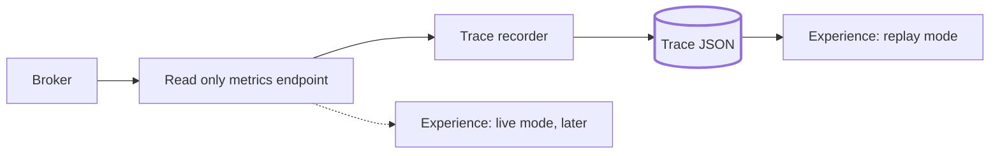

# Lesson 1: Start with the shape, not the engine

[Index](README.md) · Next: [Architecture you can test without a headset →](02-architecture.md)

**You'll learn:** how to write constraints that actually constrain, how to choose an
engine for a standalone headset, why this project plays recorded data before live
data, and how to write milestones an AI agent can't fake.

**Needs:** nothing installed. About 20 minutes.

---

## The project in one paragraph

Five minutes in a Meta Quest headset. You stand next to an empty workbench. A GPU rig
with eight graphics cards assembles itself around you. It powers on. A prompt arrives,
and you watch it travel through a broker, a scheduler and a Mac Mini, then land on one
specific card in front of you. The card lights up and runs hot while the model
generates. Then the system view fades and you are back next to the rig, which is now
just a machine on a bench.

It is an **experience**, not a tutorial. Nobody is quizzed and nothing is gated. That
single decision removes most of the interaction design work, and it means pacing
matters more than anything the viewer can click.

## Constraints are only useful if breaking them has a cost

Every project has a wish list. A constraint is different: it names what breaks if you
ignore it. This project's `CLAUDE.md` lists them as hard constraints, and each one
earns its place:

| Constraint | What happens if you ignore it |
|---|---|
| Unity 6 LTS, Universal Render Pipeline | Built in RP runs on Quest but throws away the mobile optimisations that make 72 fps reachable |
| Android, ARM64, IL2CPP | The Quest rejects anything else at install time |
| Quest 2 as the minimum device | A Quest 3 only experience can't be shown to most people who own a headset |
| 72 fps floor | Dropped frames in a headset cause nausea. A dropped frame is a bug, not polish |
| Single Pass Instanced stereo | Rendering each eye separately roughly doubles draw call cost |
| Reads one read only endpoint, holds no credentials | The headset gets passed around a classroom |
| Runs end to end with no infrastructure | A demo that needs the GPU rigs to be up is a demo that eventually doesn't happen |

The last column is what makes these useful to an AI agent. "Keep it fast" is ignored.
"A dropped frame is a bug" gets acted on.

> **Try it**
>
> Write three hard constraints for a project of your own. For each, write the concrete
> thing that breaks if it's violated. If you can't name the breakage, it's a
> preference. Move it to a different list.

## Choosing an engine for a standalone headset

The obvious comparison is Unity against Unreal, and Unreal usually wins on visuals. But
its headline features, Nanite for geometry and Lumen for lighting, do not run on the
mobile renderer a standalone Quest uses. On this hardware, Unreal's visual advantage is
switched off, and its cook and package loop is slower. So Unity won, and the decision
was written down as closed, along with the one thing that would reopen it: a move to a
PC tethered headset.

A third option stayed open for a while: **WebXR with three.js**. That trades
performance for distribution. Instead of sideloading an APK, you share a link. The
design docs noted that switching was nearly free while no scenes or art existed, and
got more expensive with every asset added. So the decision had a deadline: settle it
before V4.

<b>Predict first:</b> why write down what would reopen a decision, not just the decision?

Because otherwise the question gets reopened every time someone new joins, including
an AI agent that notices Unreal has better lighting. A decision with its reopening
condition attached can be closed for good. A bare decision is only closed until the
next person asks.

## Replay first, live later

The experience reads a **trace**: a recorded list of hops, each with start and end
times in milliseconds and, for the GPU hop, which card ran it and how hot it got.

Replay mode is built first and is the mode that ships. Three reasons:

1. **Nobody waits on anybody.** A hand written trace, `Assets/Data/sample-trace.json`,
   went into the repo on day one. The VR work didn't have to wait for the teammate
   building the broker.
2. **Pacing can be chosen.** A live request might take 400 ms or 40 seconds. Forty
   seconds of watching a progress bar isn't an experience. A recorded trace can be
   picked, and slowed to half speed so people can follow it.
3. **The demo always works.** No network, no rigs, no credentials.

The trace format lives in [`docs/metrics-contract.md`](../metrics-contract.md) and was
sent to the broker's owner early. Adding per hop tracing to a system later is painful.
Logging a few extra fields from the start costs nothing.

## Milestones an agent can't fake

The work is split into V1 to V8, and each has an acceptance line:

> **V1 is done when:** you can put the headset on, look around a grey scene, and see
> your controllers.

Note what that sentence excludes. "The code compiles" doesn't count. "The tests pass"
doesn't count. Only the thing a person can check with the headset on counts.

This matters more with an AI agent than without one. An agent will happily report a
milestone done once its own checks pass. The rule in this repo is: **a box is only
ticked when the acceptance line is met on a headset.** When a lot of code for V3, V5
and V6 was written before any headset existed, the milestones file got a status table
describing what was code complete, and every box stayed unticked.

<b>Predict first:</b> the agent wrote the whole assembly sequence and it passed its tests. Should V3 be ticked?

No. V3's acceptance line is "the rig assembles itself start to finish, in the correct
real order". Nobody had watched it assemble. Code complete and tested is real progress,
and the status table records it, but it isn't the milestone.

## Checkpoint

- [ ] I can say, in one sentence each, what breaks if each hard constraint is ignored
- [ ] I understand why replay mode ships and live mode is optional
- [ ] I've written acceptance lines for my own milestones that a person checks, not a test runner
- [ ] I've read [`docs/experience-design.md`](../experience-design.md) and [`docs/milestones.md`](../milestones.md)

Next: [Architecture you can test without a headset →](02-architecture.md)
