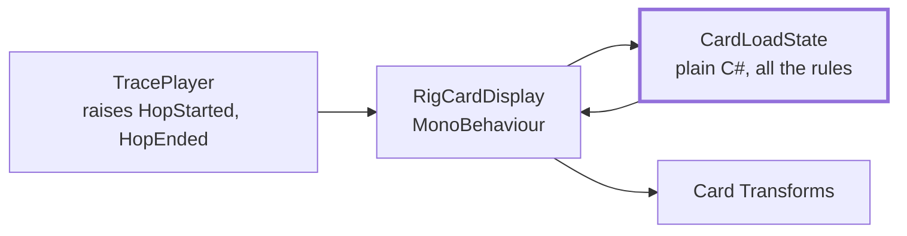

# Lesson 2: Architecture you can test without a headset

[← Lesson 1](01-shape-of-the-project.md) · [Index](README.md) · Next: [Testing Unity code when you don't have Unity →](03-testing-without-unity.md)

**You'll learn:** the one structural rule that made this project testable with no
scene and no headset, how to keep sequences in data instead of code, and what "no
allocation in Update" means in practice.

**Needs:** nothing installed. Reading the code in `Assets/Scripts/` alongside helps.
About 30 minutes.

---

## The rule

> Playback and state logic never touch Transforms.

A `Transform` is a GameObject's position, rotation and scale. Anything that reads or
writes one needs a scene. Anything that doesn't can be tested like ordinary C#.

So every behaviour in this project is split in two:

- a **plain C# class** that holds the state and makes every decision, with no
  `MonoBehaviour`, no `Transform`, nothing that needs a scene
- a thin **MonoBehaviour** that asks the plain class what to show and moves Transforms
  to match



There are three of these pairs in the project:

| Plain C# (all the logic, fully tested) | MonoBehaviour (just visuals) |
|---|---|
| `Rig/CardLoadState.cs`: which card is working, how loaded | `Rig/RigCardDisplay.cs` |
| `Rig/AssemblyTimeline.cs`: which assembly step is running, how far through | `Experience/AssemblyPlayer.cs` |
| `Experience/SystemRouteState.cs`: where the request is in the system | `Experience/SystemViewDisplay.cs` |

And the source of time is `Telemetry/TracePlayer.cs`, which raises events and knows
nothing about visuals at all.

The payoff comes in lesson 3: the most important bug in the project was in the card
lighting, and it was found and fixed in a Linux container that couldn't render a pixel.

<details>
<summary><b>Predict first:</b> the original code had all the card logic inside <code>RigCardDisplay</code>. What would it have taken to test it?</summary>

A scene, GameObjects for eight cards, a TracePlayer component wired to it, and either a
play mode test or manual calls to Unity lifecycle methods. Possible, but slow and
awkward, so in practice it doesn't get tested. After pulling the logic into
`CardLoadState`, the regression test for the worst bug is a dozen lines of plain C# with no scene at all.

</details>

## Sequences live in data, not code

The build order of the rig, the layout of the system view and every line of narration
live in **ScriptableObject** assets in `Assets/Data/`. A ScriptableObject is a Unity
asset that holds data and shows up in the inspector.

| Asset | Holds | Type |
|---|---|---|
| `RigLayout.asset` | card count, spacing, position of card 0, temperature range | `RigLayout` |
| `AssemblySequence.asset` | the 23 step build order, each with travel and settle time and a narration line | `AssemblySequence` |
| `SystemGraph.asset` | the six nodes: client, broker, scheduler, Mini, two rigs | `SystemGraph` |
| `NarrationTrack.asset` | 12 lines keyed by cue | `NarrationTrack` |

Why bother: the design says narration gets rewritten after testing on three people who
aren't on the team. If it lives in code, every rewrite needs a programmer and a
recompile. In an asset, anyone can retime a step or reword a line in the inspector.

Narration uses a small cue format so lines can be written before the visuals exist:

```
act.Assembly          when Act 2 starts
step.gpu-0            when the first card flies in
hop.Model             when the model starts generating
```

The sequencer also waits on the data instead of a timer. Act 2 lasts exactly as long
as the assembly sequence, however someone retimes it:

```csharp
SetAct(Act.Assembly);
if (assemblyPlayer != null)
{
    _assemblyDone = false;
    assemblyPlayer.Play();
    while (!_assemblyDone) yield return null;
}
```

## The seam between teams is a file format

The broker was being built by someone else. The contract between the two halves is the
trace format, and three choices in it are worth copying:

1. **Times are relative to trace start**, not wall clock. A trace replays identically
   no matter when it was recorded.
2. **The VR side sorts by start time**, not array position, so out of order writes are
   fine.
3. **Unknown hop types are skipped, not errors.** The broker can add a new hop type
   without breaking a headset build that has already shipped.

<details>
<summary><b>Predict first:</b> in <code>Hop</code>, the field <code>gpu_index</code> defaults to <code>-1</code>, not <code>0</code>. Why?</summary>

Unity's `JsonUtility` leaves a missing field at whatever value the field was initialised
to. Most hops, like the client or broker hop, have no GPU at all. If the default were
`0`, every one of those hops would silently claim to run on card 0, and card 0 would
light up at the wrong moments. With `-1`, "no card" is distinguishable from "card 0",
and there's a test named `AbsentGpuIndexIsNotCardZero` that guards it.

</details>

## No allocation in Update

On a phone class chip, the garbage collector pausing for a few milliseconds shows up as
a stutter, and in a headset a stutter feels bad in a way it doesn't on a monitor. So
nothing that runs every frame may allocate memory. In practice that means:

- **Build strings once.** `NarrationDirector` builds every cue string (`"act.Assembly"`,
  `"hop.Model"`) in `Awake`, not when an event fires.
- **Reuse objects.** When a step carries its own narration, the director reuses one
  `NarrationLine` instance instead of creating a new one.
- **Know what allocates.** `Hop.Type` calls `ToLowerInvariant()`, which creates a new
  string. That's fine at load time, but it must never be called every frame.
- **Allocate in constructors.** `CardLoadState` creates its three arrays when
  constructed and never again.

> **Try it**
>
> Open `Assets/Scripts/Rig/CardLoadState.cs`. Find every place memory could be
> allocated. You should only find the three `new` calls in the constructor.

## Checkpoint

- [ ] I can explain why a class that touches Transforms is hard to test
- [ ] I can name the plain C# class behind each of the three visual components
- [ ] I know which asset to edit to retime an assembly step or reword a narration line
- [ ] I understand why `gpu_index` defaults to `-1`

Next: [Testing Unity code when you don't have Unity →](03-testing-without-unity.md)
