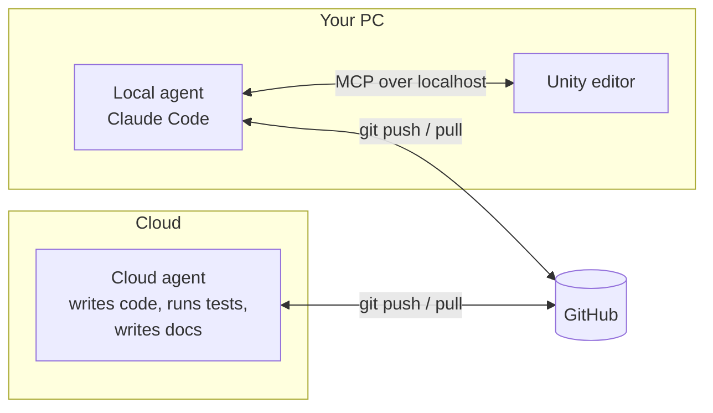

# Lesson 6: Connecting an AI agent to the Unity editor

[← Lesson 5](05-windows-setup.md) · [Index](README.md) · Next: [Building scenes from code →](07-scenes-from-code.md)

**You'll learn:** why an agent running in the cloud can't drive your editor, how to
install Claude Code on Windows, how to connect it to Unity over MCP, and how to check
the connection really works.

**Needs:** the project open in Unity (lesson 5) and a Claude Pro, Max, Team or
Enterprise account. About 30 minutes.

> **Status.** At the time of writing, Claude Code was installed and Unity's plugin was
> added, but the connection had not yet been verified end to end. The steps below are
> the ones that were followed, with the verification step still to do.

---

## Two agents, two computers

Most of this project's code was written by Claude Code running **in the cloud**, in a
container with no display. When the time came to drive the Unity editor, the obvious
question was: can the cloud agent just connect to it?

No. Unity's editor bridge listens on `localhost`, meaning only programs on the same
computer can reach it. The cloud container is a different computer, behind a locked
down network proxy. There's no route.



So the setup is two agents. The cloud one works on the repo. A local one runs on the
same PC as Unity and drives the editor. They share work through git, the same way two
people would.

<details>
<summary><b>Predict first:</b> couldn't you expose the editor bridge to the internet with a tunnel so the cloud agent can reach it?</summary>

You could, and you shouldn't. The bridge has full control of the editor: it can create,
change and delete any asset in the project. On a public URL, anyone who finds it has the
same control. The project's own runbook flags that MCP bypasses file level guardrails.
Run the agent next to the editor instead.

</details>

## What MCP is, briefly

**MCP** (Model Context Protocol) is a standard way for an AI agent to call tools that
some other program provides. Unity's MCP server offers tools like "list the scene
hierarchy", "create a GameObject", "read the console". The agent calls them, and the
editor does the work and keeps its own state in sync.

This matters because hand editing a scene file behind a running editor loses work: the
editor holds the scene in memory and will overwrite your change. `CLAUDE.md` says to
drive the editor with live commands instead of editing its files.

## Step 1: Install Claude Code

In a normal PowerShell (not Administrator):

```powershell
irm https://claude.ai/install.ps1 | iex
```

What this project saw:

```
√ Claude Code successfully installed!
  Version: 2.1.282
  Location: C:\Users\<you>\.local\bin\claude.exe

‼ Setup notes:
  ● Native installation exists but C:\Users\<you>\.local\bin is not in your PATH.
```

## Step 2: Fix PATH, then open a new window

The installer put `claude.exe` somewhere Windows doesn't look for commands. You can add
it through System Properties, or in one line:

```powershell
[Environment]::SetEnvironmentVariable("PATH", [Environment]::GetEnvironmentVariable("PATH","User") + ";$env:USERPROFILE\.local\bin", "User")
```

<details>
<summary><b>Predict first:</b> why read the "User" PATH there instead of using <code>$env:PATH</code>?</summary>

`$env:PATH` is your user PATH and the system PATH merged together. Writing that back as
your user PATH would copy every system entry into it, duplicating them. Reading
`GetEnvironmentVariable("PATH","User")` gets just the user part.

</details>

Now the step that caught this project out: **close PowerShell and open a new window.**
A changed PATH only applies to programs started after the change. Running `claude` in
the same window still fails with "not recognized".

```powershell
claude --version
```

## Step 3: Log in

```powershell
cd C:\Users\<you>\VirtualLLMVisualizer
claude
```

A browser opens to sign in. Starting in the project folder matters: Claude Code reads
`CLAUDE.md` from there, so it arrives knowing the constraints, the conventions and the
rule about not hand editing scenes.

## Step 4: Connect to Unity

There are two routes. Try the first.

### Route A: Unity's official Claude Code plugin

Unity released a first party Claude Code plugin in September 2026. It bundles Unity
specific skills, the Unity CLI and editor control. At the Claude Code prompt:

```
/plugin
```

Search for Unity and install the official plugin. This is the route this project took.

### Route B: Unity's AI Assistant package, by hand

Unity's MCP server ships in the `com.unity.ai.assistant` package. In this project it
wasn't installed, even though "Use AI Assistant" was ticked at creation, so
**Edit → Project Settings** had no **AI** section.

To install it: **Window → Package Manager → Unity Registry**, search **AI Assistant**,
install. **Edit → Project Settings → AI → Unity MCP Server** should then appear. Make
sure the bridge is running, then use its integration settings to configure Claude Code.

> **Where it went wrong**
>
> The cloud agent first told the user to open **Project Settings → AI → Unity MCP**
> from memory. That section didn't exist in their project. Then it tried to check
> Unity's documentation, and the cloud container's proxy blocked both `unity.com` and
> `docs.unity3d.com`. The plugin route came from web search results rather than Unity's
> own docs.
>
> The lesson isn't "the agent was wrong". It's that setup instructions for fast moving
> tools go stale quickly, and an agent that can't see your screen is guessing about UI.
> Screenshots fixed it every time. So did the agent saying plainly which steps it had
> checked and which it hadn't.

## Step 5: Verify

With Unity open and **not in Play mode** (Play mode blocks scene commands), restart
Claude Code so the plugin loads:

```
/exit
```
```powershell
claude
```

Then check the connection:

```
/mcp
```

You want a Unity server listed as connected. Then a real test:

> list the scene hierarchy

If you get back `Experience`, `RigRoot`, `SystemView`, `Tray` and `Parts`, the agent can
see your editor.

## If it doesn't connect

| Symptom | Try |
|---|---|
| `/mcp` lists no Unity server | Unity's side is missing. Do Route B |
| Unity server listed but commands fail | Is the editor in Play mode? Is there a red error in the Console (Safe Mode)? |
| It connects to the wrong project | More than one Unity editor is open. Close the others |
| "GameObject not found" errors | Ask for the hierarchy first. Objects have to exist before they can be referenced |

Before a long session, commit. The agent has full editor access, and you want something
to diff against.

## Checkpoint

- [ ] `claude --version` works in a new PowerShell window
- [ ] I started Claude Code from the project folder, so it read `CLAUDE.md`
- [ ] `/mcp` shows a Unity server as connected
- [ ] "list the scene hierarchy" returns the real objects
- [ ] I understand why the cloud agent can't do this, and why tunnelling isn't the answer

Next: [Building scenes from code →](07-scenes-from-code.md)
