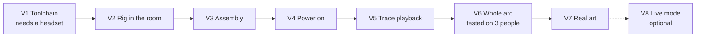

# Lesson 8: Working with AI agents: what held up

[← Lesson 7](07-scenes-from-code.md) · [Index](README.md)

**You'll learn:** how to divide work between agents and people on a project like this,
which habits produced reliable results, where the agent was wrong and how each mistake
was caught, and what's left to do on this project.

**Needs:** nothing. About 25 minutes.

---

## Who does what

Three parties worked on this project, and each was good at different things.

| | Good at | Can't do |
|---|---|---|
| **Cloud agent** | Writing and refactoring code, running tests, finding logic bugs, writing docs, generating data files | See a screen, reach your PC, touch the headset |
| **Local agent** (on the PC, over MCP) | Driving the editor, checking the scene from the camera, tuning layout | Anything the editor can't do; it's also blind to the headset |
| **You** | Hardware, taste, the headset test, deciding when it's good enough | Nothing is off limits, but your time is the scarcest thing here |

They stay in sync through git. Each agent commits and pushes, and the other pulls.

## Habits that held up

**Measure, don't guess.** "The code looks right" found nothing. Running a frame by frame
simulation found two demo breaking bugs in minutes. If you can't run the real thing,
run a model of it.

**Reproduce before you fix.** Both big bugs were shown failing with numbers before any
code changed: card 3 peaking at 0.18, and two acts starting at the same instant,
125.0 s. Then the same measurement showed the fix working.

**One regression test per bug.** Every bug got a test named after the failure:
`AdjacentHopsOnOneCardDoNotBlankIt`, `PartStaysSeatedDuringTheGapBetweenSteps`. The
test explains the bug to whoever reads it next.

**Separate "done" from "code complete".** Nothing in `docs/milestones.md` is ticked,
even though three milestones' worth of code exists. The acceptance lines need a
headset, and no headset has been used.

**Write decisions down where they'll be found.** The pinned editor version, the reason
the trace moved into `Assets/`, why TextMesh instead of TextMeshPro. Each lives in a doc
or a code comment, not only in a chat log.

**Commit messages say why.** A message like "Fix two demo breaking playback bugs"
followed by the evidence for each is worth more than the diff alone, to the other agent
and to the next person.

**One step at a time during setup.** When the setup instructions came as a long list,
the user got lost. When they came as one step, a screenshot back, and the next step,
things moved quickly. For anything involving a GUI, **screenshots are the fastest way to
get an agent unstuck.**

<b>Predict first:</b> the agent wrote a PowerShell script it couldn't run, because its container had no PowerShell. What should it have told the user?

That the script was untested, and to paste back whatever it printed. It did, and the
script worked first time on Windows. But the right move was to say so either way. An
untested script presented as tested is how people lose an afternoon.

## Where the agent was wrong, and what caught it

This is the most useful section in the series. Every one of these was a real mistake.

| Mistake | What caught it |
|---|---|
| Told the user to find **Project Settings → AI → Unity MCP**; the section didn't exist | The user's screenshot of Project Settings |
| Assumed ticking "Use AI Assistant" installed the MCP package | Same screenshot, then checking the manifest |
| Placed every scene object by guessed coordinates | The user's "what on earth is this" |
| Left a malformed line in the scene builder | Adding an editor script compile step to the harness |
| Test shim recursed until the stack overflowed | Running it |
| Fixed the shim in one place, ran a stale copy from another | The fix having no effect |
| Told the user to commit only `ProjectSettings` and `Packages`, missing assets Unity created | Pulling the commit and comparing it with the screenshot |

Two patterns stand out. First, **UI guesses were the most common failure**, because
setup screens change often and the agent couldn't see them. Second, **almost every
mistake was caught by running something or looking at something.** None were caught by
re-reading.

## Prompts that worked

**Starting a session:**

> Read CLAUDE.md and docs/milestones.md first. Tell me the lowest unfinished milestone
> and what its acceptance line needs, before changing anything.

**Asking for a check without a fix:**

> Run the tests and report exactly how many pass and fail, with full output for
> failures. Don't fix anything yet.

**Asking for a fix:**

> Before fixing, show me the failure: a failing test or a measurement. Fix it, show
> the same check passing, and add a regression test named after the failure.

**Keeping it honest:**

> For each step you give me, say whether you've actually verified it or are going from
> memory.

## What's left on this project

Next, in order:

- [ ] Confirm the 40 edit mode tests in the real Unity Test Runner
- [ ] Verify `/mcp` shows Unity connected, and fix the scene layout through it
- [ ] Commit the scene and the URP assets Unity created, with `.meta` files
- [ ] Settle the LTS question before V2
- [ ] Install the XR packages, apply the Android settings in `docs/setup-runbook.md`, build to a Quest 2
- [ ] Profile on the device from then on. The editor says nothing useful about Quest performance
- [ ] At V6, test on three people who aren't on the team. If they can't explain where the model runs, rewrite the narration and test again

That last item is the real finish line. The design doc says it plainly: the project
worked if three outsiders can explain afterwards what the rigs do and where the model
actually runs. Everything else in this series is in service of that.

## Checkpoint

- [ ] I can say which of the three parties should do each remaining item above
- [ ] I have a habit for catching an agent's UI guesses (screenshots, and asking what's verified)
- [ ] I've saved the prompts above somewhere I'll reuse them

[Back to the index](README.md)
