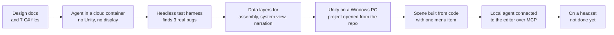

# Building a VR experience with Unity and an AI coding agent

A lesson series built from one real project: a standalone Meta Quest experience that
shows how an LLM inference request travels through a GPU cluster. It was built with
Unity 6 and Claude Code, starting from a pile of design docs and a few C# files, with
the coding agent working in a cloud container that had no Unity, no headset and no
display.

The lessons follow what actually happened, including the parts that went wrong. The
mistakes are where most of the useful material is.

## Who this is for

- You know some C# or another typed language.
- You have never shipped a Unity project, or never shipped one for a VR headset.
- You want to use an AI coding agent for real work, not a demo, and you want to know
  where it helps and where it will quietly get things wrong.

You do not need a headset to follow along. Most of this series is about getting as far
as possible before one is plugged in.

## How the lessons work

Each lesson has four kinds of interactive section. They render on GitHub.

| You'll see | What to do |
|---|---|
| **Predict first** | Answer before opening the collapsed section. The answer is inside. |
| **Try it** | A short exercise against this repo or your own project. |
| **Checkpoint** | Tick these off in your own copy before moving on. |
| **Where it went wrong** | A real mistake from this project and how it was caught. |

To keep your own progress, fork the repo or copy the lesson files and tick the boxes as
you go.

## The lessons

| # | Lesson | You'll be able to |
|---|---|---|
| 1 | [Start with the shape, not the engine](01-shape-of-the-project.md) | Write constraints, pick an engine for a mobile headset, and set milestones that mean something |
| 2 | [Architecture you can test without a headset](02-architecture.md) | Split logic from visuals so every rule is testable with no scene |
| 3 | [Testing Unity code when you don't have Unity](03-testing-without-unity.md) | Compile and run Unity C# headless, and find real bugs doing it |
| 4 | [Unity project hygiene that saves you later](04-project-hygiene.md) | Handle `.meta` files, asmdefs, LFS and data assets without breaking references |
| 5 | [From nothing to an open project on Windows](05-windows-setup.md) | Install Unity for Quest, create the project, and get through every setup trap we hit |
| 6 | [Connecting an AI agent to the Unity editor](06-connecting-ai-to-unity.md) | Install Claude Code, connect it to Unity over MCP, and verify it |
| 7 | [Building scenes from code](07-scenes-from-code.md) | Generate a whole scene from data with one menu item, and know when a human or a sighted agent should take over |
| 8 | [Working with AI agents: what held up](08-working-with-agents.md) | Divide work between agents and people, write prompts that work, and catch the agent's mistakes |

Lessons 1 to 4 need nothing installed. Lessons 5 to 7 need a Windows PC. Lesson 8 is
about process and applies to any project.

## The journey in one picture

## Where the project actually is

This series is honest about status. At the time of writing:

| | State |
|---|---|
| Runtime code and data assets | Written, and passes 40 tests in the headless harness |
| Those same tests in the real Unity Test Runner | **Not yet confirmed** |
| Scene built from code | Builds and opens. Layout is poor; see lesson 7 |
| Claude Code connected to the Unity editor | Plugin installed. **Connection not yet verified** |
| Running on a Quest | **Not started.** No headset was available |

Where a lesson describes something that has not been verified end to end, it says so.

## Related docs in this repo

- [`CLAUDE.md`](../../CLAUDE.md): the rules an AI agent reads before working here
- [`docs/experience-design.md`](../experience-design.md): what the experience is
- [`docs/milestones.md`](../milestones.md): V1 to V8 with acceptance criteria
- [`docs/setup-runbook.md`](../setup-runbook.md): the reference version of lessons 5 and 6
- [`docs/metrics-contract.md`](../metrics-contract.md): the trace format
