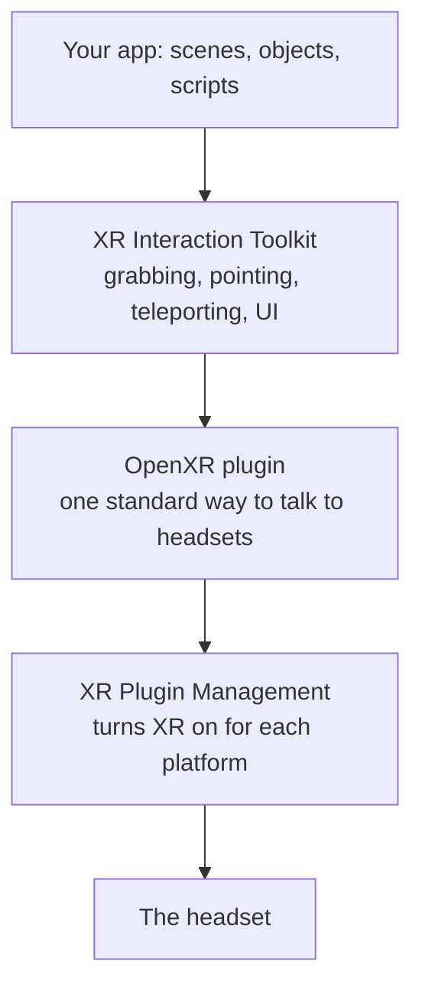

# Chapter 1: How VR apps work

[Guide home](README.md) · Next: [Install Unity and create a project →](02-install-and-create-project.md)

**Time:** 15 minutes. **Needs:** nothing installed.

Before touching any software, it helps to know what's actually going on inside a
headset. Everything in later chapters is a setting or a component that controls one of
the pieces below.

---

## What the headset is doing

A VR headset is two small screens, one per eye, with lenses in front of them. Many
times per second it does this loop:

1. **Track.** Cameras and sensors work out exactly where your head and hands are and
   which way they're facing.
2. **Render.** The app draws the scene twice, once from each eye's position. The two
   images are slightly different, and your brain turns that difference into depth.
3. **Display.** Both images go to the screens.

That loop has to run **fast and steadily**. A Quest 2 runs at 72 frames per second by
default, so the app gets about **13.9 milliseconds** to do everything for each frame.

**Why this matters:** on a normal monitor, a slow frame looks like a stutter. In a
headset, the world lags behind your head movement, and that mismatch between what your
eyes see and what your inner ear feels is what makes people feel sick. In VR, a dropped
frame is a bug, not a polish item. Chapter 9 is all about this.

## Standalone versus PC VR

| | Standalone (e.g. Quest on its own) | PC VR (e.g. Quest with Link, or a tethered headset) |
|---|---|---|
| Where the app runs | On the headset's own chip, like a phone | On a gaming PC, streamed to the headset |
| Power | Phone class | Desktop GPU class |
| What you build | An Android app (`.apk`) | A Windows app (`.exe`) |
| Who can use it | Anyone with the headset | Only people with a capable PC |

This guide targets **standalone Quest**, because that's what most people own. It means
your app must be designed for phone-level graphics power. It also means Unity's
**Universal Render Pipeline (URP)**, which is built for exactly that.

## How Unity talks to a headset

There are three layers. You'll install all three in chapter 3.



- **XR Plugin Management** is the on switch. It decides which XR system to start for
  each platform you build for.
- **OpenXR** is the translator. It's an industry standard, so the same app can run on
  Meta, Pico, HTC and other headsets without rewriting it.
- **XR Interaction Toolkit (XRI)** is Unity's ready-made set of VR behaviours: hands,
  laser pointers, grabbing, buttons, teleporting and menus. Without it you'd write all
  of that yourself.

## The player, in Unity terms

In a normal game, the player is often a character and a camera that you move with the
keyboard. In VR, **the player's real body moves the camera**. So instead of a normal
camera, a VR scene has an **XR Origin**:

```
XR Origin
├── Camera Offset
│   ├── Main Camera        ← follows your real head
│   ├── Left Controller    ← follows your real left hand
│   └── Right Controller   ← follows your real right hand
└── Locomotion             ← moves the whole thing when you teleport or walk
```

The XR Origin marks where the play area's floor is in your virtual world. When you
physically step forward, the camera moves inside it. When you teleport, the whole XR
Origin jumps to a new place.

<details>
<summary><b>Check yourself:</b> you want the player to teleport to the other side of a room. Do you move the Main Camera, or the XR Origin?</summary>

The XR Origin. The camera's position inside the origin always comes from the real
headset, so anything you set on it directly gets overwritten next frame. Move the
origin, and the camera comes with it.

</details>

## Interactors and interactables

XRI splits every interaction into two sides:

- An **interactor** does the touching: a hand that grabs, a ray that points, a finger
  that pokes.
- An **interactable** is the thing touched: a cup, a button, a lever.

An interaction goes through two stages. **Hover** means the interactor is near or
pointing at the interactable. **Select** means the player has pressed grip or trigger
on it. Most of what you build in chapter 5 is choosing the right interactable and
reacting to hover and select.

## One unit is one metre

In Unity, 1 unit equals 1 metre. In VR that's not just a convention: the headset
reports real distances, so a table that's 5 units tall really looks 5 metres tall. Build
at real size and everything feels right. Get it wrong and the whole world feels like a
dollhouse or a giant's house.

## Checkpoint

- [ ] I can explain why a steady frame rate matters more in VR than on a monitor
- [ ] I know what standalone means, and why it pushes us to URP
- [ ] I can name the three XR layers and what each does
- [ ] I know the XR Origin is the player, and teleporting moves the origin
- [ ] I know the difference between an interactor and an interactable

Next: [Install Unity and create a project →](02-install-and-create-project.md)
